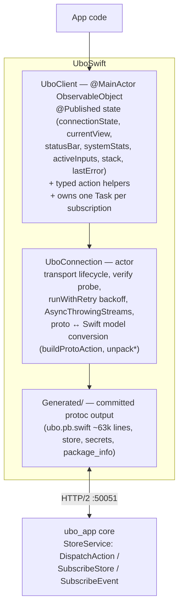

# UboSwift

Swift client library for connecting to Ubo devices via gRPC. This is the
transport layer used by the Apple apps in the sibling
[`ubo-swift-app`](../ubo-swift-app) repo; it can also be used standalone.

## Table of contents

- [Requirements](#requirements)
- [Products](#products)
- [Quick start](#quick-start)
- [Architecture](#architecture)
- [Reconnection behaviour](#reconnection-behaviour)
- [Security model](#security-model)
- [Proto generation and drift](#proto-generation-and-drift)
- [Hand-maintained sync points](#hand-maintained-sync-points)
- [Logging](#logging)
- [Testing](#testing)

## Requirements

- Swift tools 6.0+ (sources compile in Swift 5 language mode)
- iOS 18 / macOS 15 / watchOS 11 / tvOS 18 / visionOS 2
- grpc-swift **v2** stack (`grpc-swift-2`, `grpc-swift-nio-transport`,
  `grpc-swift-protobuf`) + `swift-protobuf`

## Products

- **`UboSwift`** — the library.
- **`ubo-test`** — an interactive CLI harness (`swift run ubo-test`) for
  manually exercising a live core: connect, press keys, subscribe, etc.
  It is not an automated test.

The Apple apps reference this package **locally**
(`../ubo-swift-grpc` from the Xcode project), so changes here are picked
up without pushing.

## Quick start

```swift
import UboSwift

let client = UboClient()
try await client.connect(host: "ubo.local")   // port 50051, plaintext

// Dispatch typed actions
try await client.pressKey(.up)
try await client.setVolume(0.5)
try await client.notify(title: "Hello", content: "World", chime: .add)

// Observe state (UboClient is @MainActor + ObservableObject)
client.$currentView.sink { view in /* render ViewData */ }
client.startViewSubscription()

await client.disconnect()
```

`UboClient` exposes ~60 typed helpers (keys, menu navigation, audio,
display, RGB ring, notifications, power, assistant, camera, input forms)
— see `UboClient.swift`; each wraps a `UboAction` case.

## Architecture

Two layers:



- **`UboConnection`** (actor) owns the `GRPCClient` and the generated
  `StoreService` client. `connect()` tears down any previous transport,
  starts `runConnections()` in a background task, then probes with
  lightweight `subscribeStore` calls until the transport verifies or a
  10 s deadline passes. Failures are classified by typed `RPCError` code
  (`.unavailable` etc. → keep probing; anything else → abort).
- **`UboClient`** (`@MainActor`) is the app-facing façade: each
  `startXxxSubscription()` spawns a task consuming one of the connection's
  `AsyncThrowingStream`s and mirrors values into `@Published` properties.
  `disconnect()` cancels them all.

### Subscription model

Two server-streaming primitives, mirroring the core's gRPC contract:

- **Store subscriptions** (`subscribeStore`) — dotted selector strings
  (e.g. `"state.main.current_view"`); each response carries positional
  `google.protobuf.Any` results unpacked by **type-URL suffix**.
  ⚠️ Unpacking is positional: `results[0]` ↔ first selector. Keep selector
  order and unpack order in sync.
- **Event subscriptions** (`subscribeEvent`) — prototype `Event` messages
  select which oneof variants to receive (display render, playback,
  frame stream, camera events).

All streams are **bounded** (`bufferingNewest`): a stalled consumer drops
oldest items instead of growing memory. Every stream funnels through
`runWithRetry` (below), and proto messages are converted into hand-written
plain-Swift `Sendable` models (`ViewData`, `StatusBarData`, `SystemStats`,
`MenuItemData`, …) at the connection layer — generated types never leak
into app code.

## Reconnection behaviour

`ReconnectPolicy` (default): 8 fast attempts at 0.2 s, then exponential
from 1 s capped at 30 s, giving up after 50 attempts. `runWithRetry` adds:

- **attempt reset** after ≥30 s of healthy streaming, so sporadic blips
  over a long session never exhaust the budget;
- ±20 % jitter to de-synchronise the parallel subscriptions;
- a 0.2 s floor so a server that closes streams immediately can't drive a
  hot re-subscribe loop;
- give-up is logged (`UboLog.subscription`) and surfaced through the
  stream's terminal error.

`connectionState` flips to `.reconnecting` during retries and back to
`.connected` on the first successful message.

## Security model

Be aware of what this client does **not** do:

- Default transport is **plaintext** on `:50051`, matching the core's
  default listener. The core's `:50051` has **no authentication** — any
  host that can reach it can dispatch `powerOff`, `reboot`, or read input
  form contents. Treat network reachability as the security boundary
  (LAN / tunnel).
- `.tls(...)` is supported for connecting through a TLS-terminating tunnel
  (e.g. reverse-proxy at 443 → h2c to the device).
- There is no token or certificate-pinning hook in the client today; if
  the core grows an authenticated endpoint this layer must be extended.

## Proto generation and drift

The `Generated/` tree is **committed**. Regeneration flow:

```bash
brew install protobuf swift-protobuf grpc-swift

# 1. The proto sources live in the sibling Python repo and are themselves
#    generated from the core's Redux types:
uv run poe proto:generate          # from the ubo-apple-apps root

# 2. Regenerate the Swift bindings:
./generate-protos.sh               # or: uv run poe proto:swift

# 3. CI / sanity: regenerate into a temp dir and diff vs committed:
./generate-protos.sh --check       # or: uv run poe proto:swift:check
```

`generate-protos.sh` **pins the tool versions** (protoc, protoc-gen-swift,
protoc-gen-grpc-swift) and refuses to run with anything else — the
`--check` drift gate is only meaningful when everyone generates with
identical tools. Bump the pins in the script together with a full
regeneration commit (`UBO_SKIP_TOOL_VERSION_CHECK=1` to experiment).

⚠️ **The proto is generated from the running core's Python types, so field
numbers and oneof tags can differ between core checkouts.** The bindings
committed here must match the core you talk to; after rebasing the core,
regenerate and rebuild all clients (see the `client-app-sync` skill in the
parent repo).

## Hand-maintained sync points

Things that do **not** regenerate automatically and are guarded by tests:

- **`protoValue` enum tables** (`Key`, `Chime`, `AudioDevice`,
  `NotificationImportance`, `NotificationDisplayType`,
  `DisplayBlankTimeout`) — hand-transcribed numeric mappings.
  `EnumTableGuardTests` pins each table to the generated enums by value,
  name, and case count; a core-side renumber fails these tests instead of
  silently degrading to `...Unspecified`.
- **`buildProtoAction`** — the `UboAction` → proto switch is exhaustive
  (no `default`), so a new enum case without a mapping is a compile error;
  `ActionBuildTests` additionally asserts every case populates the oneof.
- **Keypad semantics** — the core's keypad reducer matches on the full
  pressed set, not just `key`: a bare press must send
  `pressed_keys == [key]`, a release `[]`, a combo `[key] + modifiers`,
  and hold also sets `held_keys`. The builders encode this; don't
  "simplify" the pressed-keys population away.
- **betterproto casing quirk** — the core names one message `WebUI...` but
  betterproto emits `WebUi...`; `unpackActiveInputs` matches type-URLs
  case-insensitively for this reason.
- **Positional store unpacking** — see the warning in
  [Subscription model](#subscription-model).

## Logging

`UboLog` wraps `os.Logger` (subsystem `com.ubopod.uboswift`; categories:
`connection`, `subscription`, `input`, `action`, `audio`, `camera`,
`discovery`). Set verbosity at app startup:

```swift
UboLog.level = .debug   // every subscription event and dispatch
UboLog.level = .info    // lifecycle only (default)
UboLog.level = .off
```

Filter in Console.app: `subsystem:com.ubopod.uboswift category:connection`.

## Testing

```bash
swift test
```

Offline/in-process suites:

- `ActionBuildTests` — every `UboAction` case builds a populated proto;
  keypad pressed/held-key shapes.
- `EnumTableGuardTests` — protoValue tables vs generated enums (drift
  guard, see above).
- `ViewDataRoundTripTests` — proto → `ViewData` conversion for all seven
  view types.
- `InputDescriptionTests` — `WebUIState.active_inputs` unpacking incl. the
  casing quirk.
- `ReconnectPolicyTests` — the backoff schedule.

Not covered (by design, they need a live server): connection
verification, retry loop timing, stream lifecycle. Exercise those
manually against a core with `swift run ubo-test`.

## License

Apache License 2.0
